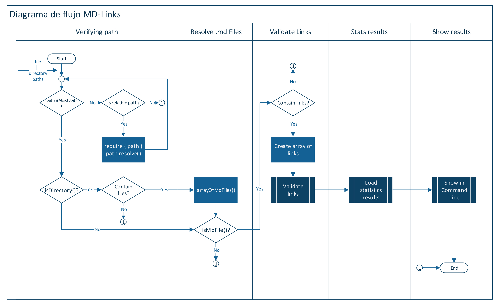

# Markdown Links Validator

* [1. Background Project](#1-background)
* [2. Project Objectives](#2-objectives)
* [3. Flowchart](#3-flowchart)
* [4. Install](#4-install)


***

## 1. Background Project

This is a project developed within my studies at the Laboratory Bootcamp in Peru. 
This time we have code for Backend enviroment creating a module to validate links in .md Files.


## 2. Project Objectives

In this project is a command line tool as a library published in NPM.

* [ ] Executable in NodeJS.
* [ ] Executable in differents operating systems.


## 3. Flowchart

Pseudo code or flowchart with the algorithm that solve the validation:




## 4. Install

npm i mdlinks-verobc


### Declaring program variable

const mdlinks = require('mdlinks-verobc')


### Command Line Interface (CLI)

- Command line: `md links <path-to-file> [options]`

- Command:  `md links`
- Path: <path> a valid folder name or filename 
- Options:
    - `--validate` 
    - `--stats`
    - `--validate --stats` 


### CLI Example without options

`md links <path-to-file> [options]`

Example:

```sh
$ md links filename.md

./some/example.md http://linkone.com/2/3/  TextOne
./some/example.md https://linktwo/text.html  TextTwo
./some/example.md http://linkthree.com/ TextThree
./some/example.md http://linkfour.com/  TextFour
```
This command gives a list of the routes, links and texts of all links in all .md files.


#### Options

##### `Option:  --validate`

This option validate all links.

Example:

```sh
$ md links foldername --validate

./some/example.md http://linkone.com/2/3/ ok 200  TextOne
./some/example.md https://linktwo/text.html ok 301 TextTwo
./some/example.md http://linkthree.com/ fail 404  TextThree
Broken: ./some/example.md http://linkfour.com/  TextFour
```

##### `Option:  --stats`

This option gives the total list of links and how many are unique.

Example:

```sh
$ md links filename.md --stats

Total: 4
Unique: 4
```

##### `Option: --validate --stats`

This option gives the total list of links and how many are unique and broken.

Example:

```sh
$ md links foldername --validate --stats 
Total: 3
Unique: 3
Broken: 1
```
